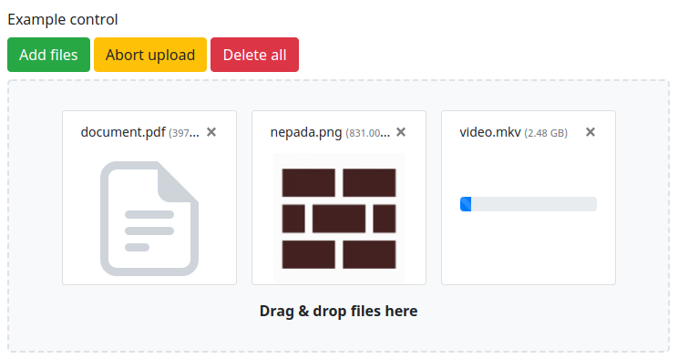

File Upload form control
========================

[](https://travis-ci.org/nepada/file-upload-control)
[](https://coveralls.io/github/nepada/file-upload-control?branch=master)
[](https://packagist.org/packages/nepada/file-upload-control)
[](https://packagist.org/packages/nepada/file-upload-control)


Installation
------------

Via Composer:

```sh
$ composer require nepada/file-upload-control
```

### Register and configure container extension

The only required configuration option is `uploadDirectory`, which determines where are the uploaded files temporarily stored. 
```yaml
extensions:
    fileUploadControl: Nepada\Bridges\FileUploadControlDI\FileUploadControlExtension
fileUploadControl:
    uploadDirectory: %appDir%/../files/uploads
```

### Add factory method to your forms

#### Option A: install form container extension method via DI extension

```yaml
fileUploadControl:
    registerExtensionMethod: true # defaults to false
```

This will register extension method `addFileUpload($name, $label = null): FileUploadControl` to `Nette\Forms\Container`.

#### Option B: use trait in your base form/container class

You can also use `FileUploadControlMixin` trait in your base form/container class to add method `addFileUpload($name, $label = null): FileUploadControl`. You need to inject `FileUploadControlFactory` into every form/container you create, e.g. by combination of a common form factory service and decorator configuration for enabling injects.

Example:

```yaml
services:
    - FormFactory
decorator:
    Form:
        inject: true
```

```php
trait FormControls
{

    use \Nepada\Bridges\FileUploadControlForms\FileUploadControlMixin;

    public function addContainer($name)
    {
        $control = new Container;
        $control->injectFileUploadFactory($this->fileUploadControlFactory);
        $control->setCurrentGroup($this->getCurrentGroup());
        if ($this->currentGroup !== null) {
            $this->currentGroup->add($control);
        }
        return $this[$name] = $control;
    }

}

class Container extends \Nette\Forms\Container
{

    use FormControls;

}

class Form extends \Nette\Application\UI\Form
{

    use FormControls;

}

interface FormFactory
{

    public function create(): Form;

}
``` 


Usage
-----

`FileUploadControl` provides a way to upload files similarly to the standard `Nette\Forms\Controls\UploadControl`. The main difference is that the files are uploaded in chunks via AJAX requests into the temporary storage. This means you can upload multiple large files without the risk of running into server-side file/POST size limits. After submitting the form, the form control's value is set to a list of `FileUpload` instances of previously uploaded files in temporary storage.

### Configuration

The DI extension supports to following configuration options:
```yaml
fileUpload:
    uploadDirectory: path/to/temp/storage # required, no default value
    registerExtensionMethod: true # defaults to false
    templateFile: path/to/alternative/control-template.latte # defaults to the bundled Bootstrap 4 template
    thumbnails: # image thumbnail settings
        enable: true
        width: 200
        height: 150
```

### Validation

All standard Nette file upload related validations work as expected. Furthermore, you can limit the number of allowed uploads by "length" rules. 

### Client side

This package comes with client side built on top of [blueimp-file-upload](https://yarnpkg.com/package/blueimp-file-upload). It is published as npm package [@nepada/file-upload-control](https://yarnpkg.com/package/@nepada/file-upload-control).

The default Latte template and bundled styles are build for [Bootstrap 4](https://yarnpkg.com/package/bootstrap).


#### Using precompiled bundle

Using precompiled bundles is the quick'n'dirty way of getting client side to work.

```html
<link rel="stylesheet" href="https://unpkg.com/@nepada/file-upload-control@%5E1.0/dist/css/file-upload-control.min.css">
<script src="https://unpkg.com/jquery@%5E3.5.0/dist/jquery.min.js"></script>
<script src="https://unpkg.com/blueimp-file-upload@%5E10.10.0/js/vendor/jquery.ui.widget.js"></script>
<script src="https://unpkg.com/blueimp-file-upload@%5E10.10.0/js/jquery.fileupload.js"></script>
<script src="https://unpkg.com/nette-forms@%5E3.0.3/src/assets/netteForms.min.js"></script>
<script src="https://unpkg.com/@nepada/file-upload-control@0.0.1/dist/js/file-upload-control.min.js"></script>
```

#### Building your own bundle

It is highly recommended to install the client side package via nmp and compile your own bundle.

Here is an example script for initialization of file upload control and Nette forms.  

```js
import Nette from 'nette-forms';
import initializeFileUploadControl from '@nepada/file-upload-control';

initializeFileUploadControl(Nette);

Nette.initOnLoad();
```

You can also customize the default look by importing the source sass files, or writing your own from scratch. 
